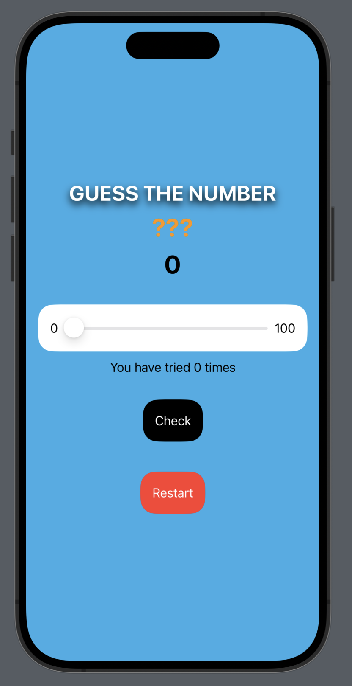
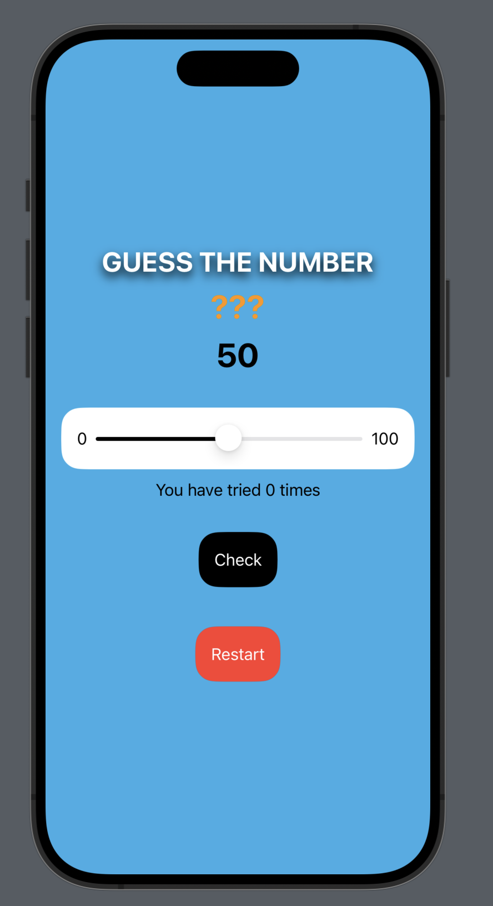
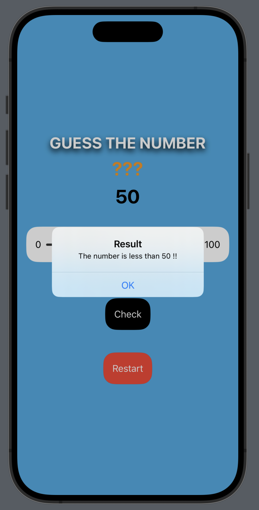
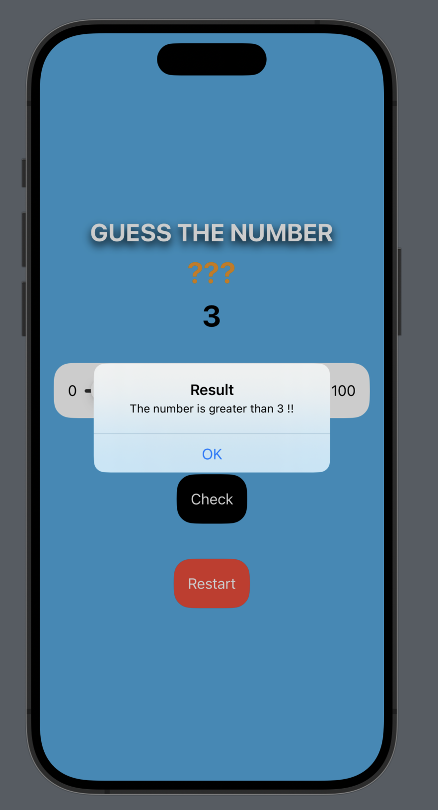
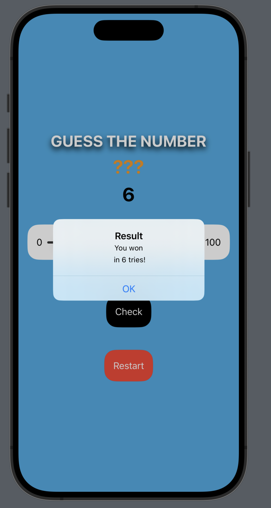
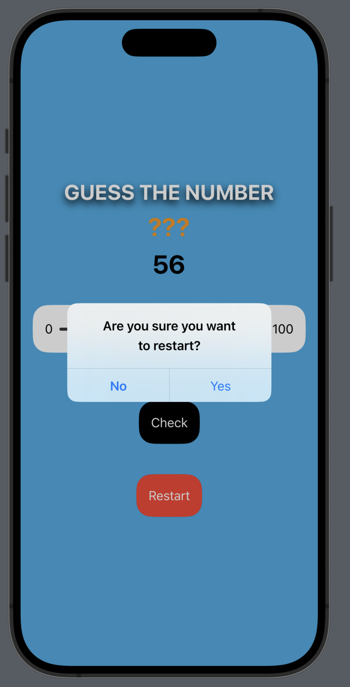

# CN436-AS1
6410615030 Natiphon Chanphet
[Demo Clip](https://youtu.be/64LcWySUfGM)

## About the Game
This game is a number guessing game where the player has to guess a number, and the game provides hints if the guess is incorrect, indicating whether the guessed number is higher or lower than the correct number. The game continues until the player correctly guesses the number. When the game ends, it will display a message indicating the total number of rounds the player took before making the correct guess.

### How to play

* The game will randomly generate a number between 1-100 for the player to guess.

* The player will slide the slider to pick the number they want to guess. Then click the "Check" button to submit the answer.

* The game will pop up a message to give a hint to the player, indicating whether the guessed number is higher or lower than the correct number.

* When the player correctly guesses the number, the game will display a message stating their victory and show the total number of attempts before making the correct guess. After click OK, the game will restart.

* Player can click "Restart" button to restart the game.

